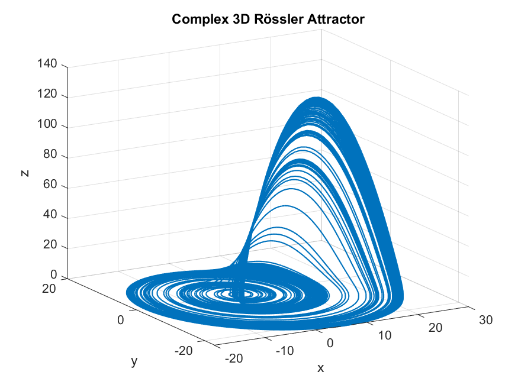

# Rössler Attractor Simulation in MATLAB

## Introduction

This repository contains MATLAB code to simulate and visualize the Rössler Attractor in 3D. The Rössler Attractor is a well-known chaotic dynamical system that exhibits intricate and complex behavior. This simulation uses the Euler method to numerically integrate the system's equations and visualize the resulting trajectory.

dx/dt = -y - z

dy/dt = x + a * y

dz/dt = b + z * (x - c)



## About the Author

This simulation was created by Víctor Duarte Melo.

- Email: victormeloasm@gmail.com

## Prerequisites

To run the simulation, you'll need MATLAB installed on your computer.

## Acknowledgments

This simulation is based on the principles outlined in the paper by Dr. Bernd Ulmann:

- **Paper Title**: Chaotic attractors in the Rössler system
- **Author**: Dr. Bernd Ulmann
- **Publication**: [Download PDF](https://analogparadigm.com/downloads/alpaca_1.pdf)

## Getting Started

1. Clone this repository to your local machine:

   ```bash
   git clone https://github.com/victormeloasm/RosslerAttractor.git
   cd RosslerAttractor
   ```

2. Open the `Rossler.m` file in MATLAB.

3. Run the script to simulate and visualize the Rössler Attractor.


